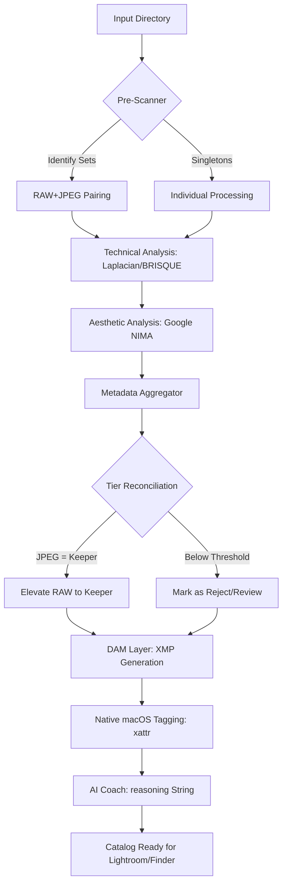

# Antigravity Engine (v2.1.0) 🚀

**The Professional AI Image Workbench & Batch Studio for macOS.**

Antigravity is a privacy-first, professional-grade suite for photographers. It streamlines aesthetic grading, high-precision background removal, and massive autonomous batch processing by leveraging **Native macOS M4 Acceleration** and **Multi-modal AI**.

---

## ✨ Features at a Glance

- **Native M4 Image Engine**: Bypasses virtualization to leverage Apple Silicon's Core Image and Accelerate frameworks directly.
- **RAW+JPEG Synchronization**: Intelligent "Pairing" logic that protects high-potential RAW negatives when their JPEG counterparts are identified as keepers.
- **Aesthetic AI Coaching**: Real-time scoring using **NIMA (Neural Image Assessment)** to mathematically assess composition and color harmony.
- **Non-Destructive Metadata Labeling**: Generates industry-standard **XMP sidecars** and **macOS Finder Color Tags** without altering a single pixel of your original masters.
- **Privacy-First (Local LLM)**: Full integration with **Ollama** for offline AI analysis.
- **Adaptive Intelligence Layer**: A hardware-aware Mixture of Experts (MoE) system with statistically rigorous evaluation. [Read the Technical Manifesto](docs/INTELLIGENCE_LAYER.md).

---

## 🗺 User Journey: The Photographer's Workflow

1.  **Ingestion & Staging**: Connect your SD card and point the **Batch Studio** to your target directory.
2.  **AI Scoping**: The engine executes a "pre-flight scan" to identify RAW+JPEG pairs and extract Technical/Aesthetic metrics.
3.  **Tier Reconciliation**: The engine automatically "elevates" RAW files to the **Keeper** tier if the corresponding JPEG is scored highly by the AI.
4.  **Metadata Tagging**: The engine writes **XMP sidecars** for Lightroom/Capture One and applies native **Green/Yellow/Red tags** in Finder.
5.  **AI Studio Refinement**: Open individual "Keepers" in the **Live Preview Canvas** to fine-tune the AI-suggested grade.
6.  **XMP Export**: Your folder is now a fully culled professional catalog, ready for any industry-standard editor.

---

## 🛠 Engineering Flow Chart

The following diagram illustrates the internal end-to-end logic of the **Antigravity Batch Engine (v2.1.0)**:



---

## 🚀 Getting Started (Native Installation)

Native M4 optimization requires zero Docker setup.

### 1. Prerequisites
- **macOS 14+** (Sonoma or later)
- **Apple Silicon** (M1, M2, M3, or M4)
- **Ollama** (Optional for offline coaching)

### 2. Installation
Clone the repository and install dependencies natively:
```bash
npm install
cd batch-backend-v2
pip install -r requirements.txt
```

### 3. Launching the Engine
On your primary Mac machine, start the backend processing service:
```bash
bash start.sh
```
Then, in a separate terminal, launch the Antigravity dashboard:
```bash
npm run dev
```

---

## ⚖️ Technical Specifications
- **Frontend**: Next.js 15+ (App Router), Lucide Icons, Glassmorphic CSS.
- **Backend API**: FastAPI (Python 3.12+), Uvicorn.
- **AI/Vision**: Core Image, Accelerate, Google NIMA (via PyTorch/TensorFlow), Zero-DCE.
- **Metadata Management**: `pyexiv2` for XMP, `xattr` for macOS native tags.

---

## 💡 Troubleshooting
- **"Finder tags not appearing"**: Ensure the target folder is on a locally mounted APFS/HFS+ drive. External network drives (SMB) may not support native macOS tagging.
- **"Ollama Connection Refused"**: Ensure the Ollama app is running in your menu bar and your model URL is set correctly in settings.
