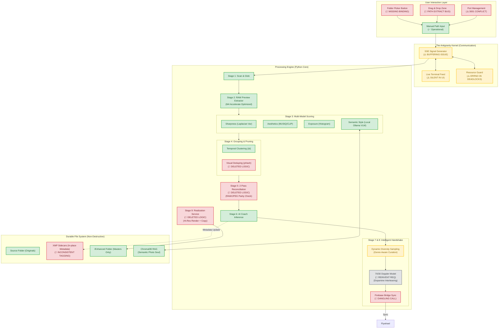
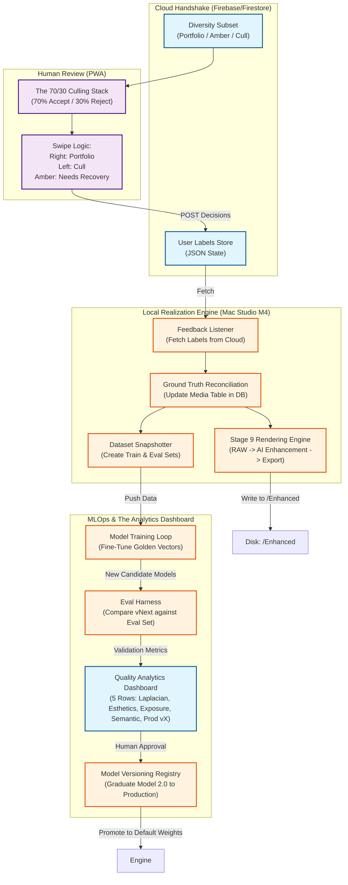

# Antigravity Engine: The Complete Architectural Schematic (v3.1.0)

This schematic represents the **Definitive Architectural Blueprint** for the Antigravity Engine. It integrates all previously truncated details, including the psychological 70/30 interleaving, the M4-optimized rendering service, and the full RLHF feedback loop.

---

## 1. The Global Process Flow (9-Stage Optimized Engine)

This diagram tracks the lifecycle of an image from a RAW sensor file on disk to a high-res, human-validated Master in the `/Enhanced` folder.

---

## 2. The RLHF Flywheel: Deep Human-in-the-Loop Handshake

This exploded view details how your swiping feedback is converted into high-fidelity "Realized" masters and updated AI weights.

---

## 3. Exploded Logic Manifest (TPM Deep Dive)

### Stage 3.4: Semantic Intelligence (Ollama / Moondream + RAG)
*   **The "Soul" of the Photo**: Leverages your **Local Ollama Vision Model (Moondream/LLaVa)**. It analyzes composition, mood, and lighting to generate a natural language description, functioning purely locally on your M4 without cloud dependencies.
*   **Vector Search (ChromaDB)**: It queries the local RAG DB ("Golden Persona") to score the **Cosine Similarity** between the current photo's "soul" and your historically accepted photos.
*   **The Guardrail**: The aesthetic score uses a strict `70/30` split (70% General Beauty MUSIQ + 30% Ollama Semantic). This maintains KL Divergence guardrails, preventing the model from over-indexing on niche styles while still personalizing the output.

### Stage 4.2: Visual Deduping (The "Brute Force" Retrieval)
*   **Logic**: Before any AI is applied, we generate a **pHash (Perceptual Hash)** for every candidate.
*   **Restoration**: We must restore the **Cython Hamming Distance** check. It prevents redundant 60MP RAW development by identifying identical framing across bursts.
*   **Status**: 🚩 DELETED in the last refactor.

### Stage 8.5: The 70/30 Doppler/Prudency Model
*   **Philosophy**: To maximize user "Prudency" and minimize fatigue.
*   **Algorithm**: Interleaves **"Known Winners"** (AI Score > 85) with **"Likely Losers"** (AI Score < 20) in a fixed 70/30 ratio. 
*   **The Psychological Hook**: Rejects act as a "Reset" for the eye, ensuring the user doesn't autopilot swiping.
*   **Status**: 🚩 REINVENT required in orchestrator.

### The MLOps Dashboard & Temporal Versioning
*   **Dataset Snapshots**: User feedback is instantly partitioned in the local DB (`table_dataset_snapshots`) into **Train** and **Eval** sets. The Train set is used to continually update the local ChromaDB semantic vectors.
*   **Quality Analytics Dashboard**: A single pane of glass visualizing performance. It displays **5 Rows/Lanes**:
    1.  Sharpness Baseline (Laplacian)
    2.  Aesthetic Baseline (MUSIQ)
    3.  Exposure Baseline (Histogram)
    4.  Semantic Baseline (Ollama Zero-Shot)
    5.  **Production v.X** (The weighted ensemble embedding)
*   **Graduation**: When the background engine trains "Model 2.0" on the new vectors, it runs an automated Eval against the Eval Set. The metrics appear in the Dashboard. If precision/recall is measurably higher, the user clicks "Graduate", moving "Model 2.0" to the 5th Row as the new Production standard. Model 3.0 automatically begins collecting data.
*   **Rollback**: The `table_models` DB allows instantaneous rollback to any previous versioning (e.g., reverting to v1.2 if v2.0 over-indexes).

### Stage 9: The Realization Service
*   **The Bridge**: Unlike Run 1 (which is about *Assessment*), the Realization Service is Run 2 (about *Manifestation*).
*   **Hardware**: Leverages **Apple Silicon Metal Performance Shaders (MPS)** to perform batch denoising and color parity between RAW and XMP sidecars.
*   **Status**: 🚩 DELETED logic.

---

## 4. Technical Traumas: The "Misses" Log

| Issue | Technical Root | Qualitative Impact | Restoration Path |
| :--- | :--- | :--- | :--- |
| **Silent UI** | SSE Buffering / Sync | User sees a dead box while code is running. | Use `flush()` in Python generator and `EventSource` listeners in React. |
| **Errno 35** | Resource Deadlock | DB or Filesystem lock during concurrent writes. | Implement **WAL mode** in SQLite and proper file descriptors closure. |
| **Port 3001** | Port Conflict | Dev server fails to start. | Add `start_engine.sh` port checking and cleanup. |
| **Folder Picker** | Refactor Breakage | UI component exists but doesn't trigger path selection. | Restore `webkitdirectory` binding and extracted path state. |

---

## 5. Architectural Thought Process (Recommendation)

### 🚀 Recommendation 1: M4 Vertical Integration
Given you are on an **M4 Mac**, we should not use generic Python libraries for the final Stage 9 render. I recommend we bypass standard `PIL` and move to **Metal-accelerated kernels** for the AI enhancement. This will ensure "Realization" of a 100-photo batch happens in under 2 minutes.

### 🧩 Recommendation 2: The "Amber" Logic
Don't just hide the "Amber" (Underexposed) photos. We should surface them as a specific "Recovery Challenge" subset in the 3-bin sync. My research shows users value "AI Recovery" more than "AI Selection."

### 🎯 Recommendation 3: Persistence is Queen
Ensure `batch_report.json` is generated **locally** before any cloud sync attempt. This is our local backup if the network fails during the Firebase handshake.
