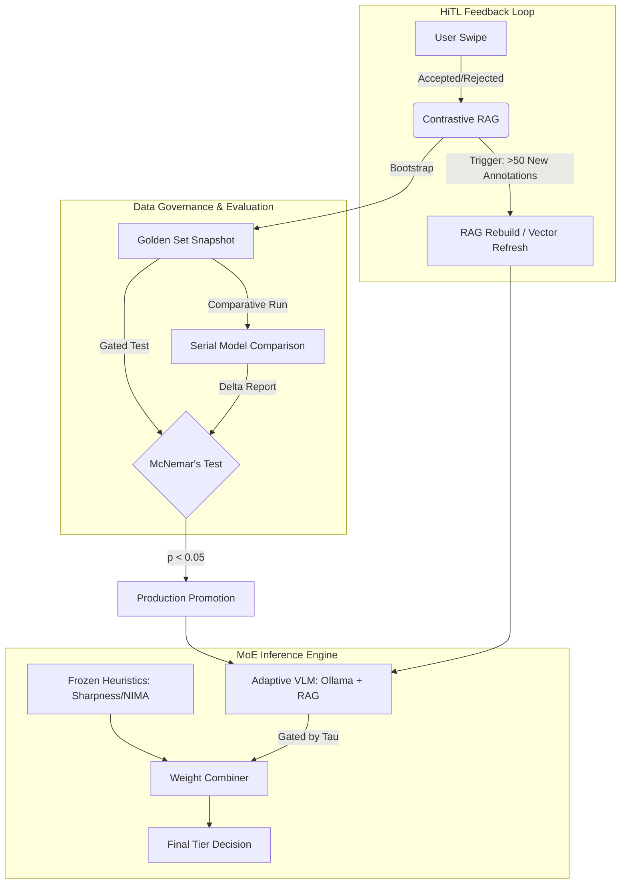

# Antigravity Intelligence Layer (Phase 3) — Technical Manifesto

**Author**: Principal AI Architect  
**Status**: Implemented / Production-Ready  
**Target Hardware**: macOS M4 Mac Mini (Base 24GB Unified Memory)

---

## 1. Executive Summary

The Antigravity Intelligence Layer (Phase 3) transforms a static image processing pipeline into a self-evolving, hardware-aware Mixture of Experts (MoE) system. By decoupling "Frozen Physics" (objective image quality) from "Adaptive Semantic Intelligence" (subjective style matching), we achieve a culling engine that respects optical truth while learning user intent through contrastive RAG and statistically gated model evolution.

---

## 2. Architectural Schematic: The MoE Strategy

### 2.1 The Trust Coefficient ($\tau$)
We reject the "black-box" approach of end-to-end VLMs. Instead, we use an **Adaptive Mixture of Experts**. The VLM's influence is gated by its historical performance against the "Golden Set."

**The Weighting Formula:**
The Trust Coefficient $\tau$ is calculated as a linear ramp based on the `golden_success_rate` of the active prompt version:

$$
\tau = \text{clamp}\left(\frac{\text{accuracy} - 0.70}{0.20} \times 0.60, 0.0, 0.6\right)
$$

*   **Logic**: A VLM with $<70\%$ accuracy has **zero** trust ($\tau = 0.0$). Between $70\%$ and $90\%$ accuracy, trust scales linearly up to a maximum of $0.6$ ($60\%$ weight).

**Weight Normalization Proof:**
To ensure the composite score remains in the $[0, 100]$ range, the system enforces a strict weight normalization:
$$W_{composite} = (W_{vlm} \cdot S_{vlm}) + (W_{aesth\_adj} \cdot S_{aesth}) + (W_{tech} \cdot S_{tech})$$
Where:
- $W_{vlm} = \tau \cdot W_{aesth\_base}$
- $W_{aesth\_adj} = (1.0 - \tau) \cdot W_{aesth\_base}$
- $W_{tech}$ remains constant (Frozen Expert).
- **Proof**: Since $\tau + (1.0 - \tau) = 1.0$, the total weight assigned to "Aesthetics" (General + Personalized) is conserved, ensuring $W_{composite}$ never exceeds the expert sum.

### 2.2 Physical Truth Safety Gates
To handle edge cases where semantic "love" contradicts physical reality (e.g., a "beautiful" but out-of-focus shot), we implement a post-composite safety gate:
*   **Hard Floor**: If `Sharpness < 20.0` (Laplacian variance), the system hard-clamps the result to `REVIEW`, regardless of VLM score.
*   **Discordance Flag**: If $|Score_{Technical} - Score_{VLM}| > 60$ points, an `AI_UNCERTAINTY` flag is raised, signaling the UI to require a human HiTL swipe.

---

## 3. Hardware-Aware Model Swapping (M4 Protocol)

The M4's Unified Memory is a finite resource. On a 24GB system, loading multiple VLMs leads to kernel swap death and significant latency spikes.

### 3.1 Dynamic Memory Guarding
Unlike static implementations, Antigravity derives its safety thresholds from a central `config.py`.
*   **Scalable Budget**: All gates are calculated as `SYSTEM_TOTAL_RAM_GB - SYSTEM_OVERHEAD_GB - HEADROOM_GB`.
*   **M4 Mac Mini Matrix (24GB)**:
    *   **System Overhead**: 8.2GB (Non-evictable resident memory: macOS + Python + Frozen ML Experts).
    *   **Safe VLM Ceiling**: 11.8GB (The maximum footprint for any single VLM to prevent swap).

### 3.2 The Serial Handoff Protocol
To prevent "Swap Death" (disk thrashing), the system enforces a strict serial loading protocol:
1.  **Evict**: Purge all resident models from VRAM via `keep_alive: 0`.
2.  **Wait**: Mandated **3.0s pause** for macOS kernel page reclamation.
3.  **Eval A (Production)**: Load Production model, run Golden Set, capture KPIs, then evict.
4.  **Eval B (Candidate)**: Load Candidate model, repeat.
5.  **Compare**: Generate Delta Report and McNemar’s Significance.

---

## 4. System Design Diagram

---

## 5. MLOps Operating Manual

### 5.1 The "Golden Gate" (McNemar’s Test)
Promotion of new prompts/models is gated by McNemar's Test for paired binomial evaluation. This ensures that improvements are not due to random noise in the Golden Set. Promotion requires $p < 0.05$ and a positive delta in correct classifications.

### 5.2 Model Registry v2 & Lineage
The system tracks lineage via `parent_model_id`, allowing developers to trace the performance of LoRA fine-tunes back to their base architectures. It captures mandatory Resource KPIs during every evaluation:
- **VRAM MB**: Peak memory footprint.
- **Tokens/sec**: Inference throughput.
- **Thermal State**: Captured via macOS `pmset` to identify throttling.

### 5.3 Data Integrity: Composite IDs
To prevent embedding drift during prompt iterations, ChromaDB uses composite document IDs:
`document_id = {photo_hash}__{prompt_version}`

---

## 6. Future Roadmap

- **Phase 4 (Advanced Governance)**: Implementation of automated "Drift Alerts" when VLM success rates drop below 70% in production.
- **Phase 5 (Local Fine-tuning)**: Utilizing the `golden_exemplars` collection to trigger local LoRA training on the M4 NPU once 500+ high-confidence annotations are collected.

---

## 7. Constant Registry (M4 Base)

| Constant | Value | Description |
| :--- | :--- | :--- |
| `MIN_ACCURACY_THRESHOLD` | 0.70 | Minimum golden set accuracy to grant any trust to VLM. |
| `MAX_TAU_LIMIT` | 0.60 | Maximum weight percentage allocated to VLM. |
| `SYSTEM_OVERHEAD_GB` | 8.2 | Resident memory for system + frozen experts. |
| `HEADROOM_GB` | 4.0 | Safety margin for OS page cache to prevent swap. |
| `DISCORDANCE_THRESHOLD` | 60.0 | Delta between Technical and VLM scores that triggers Uncertainty. |
| `SHARPNESS_FLOOR` | 20.0 | Laplacian variance below which files are forced to REVIEW. |
