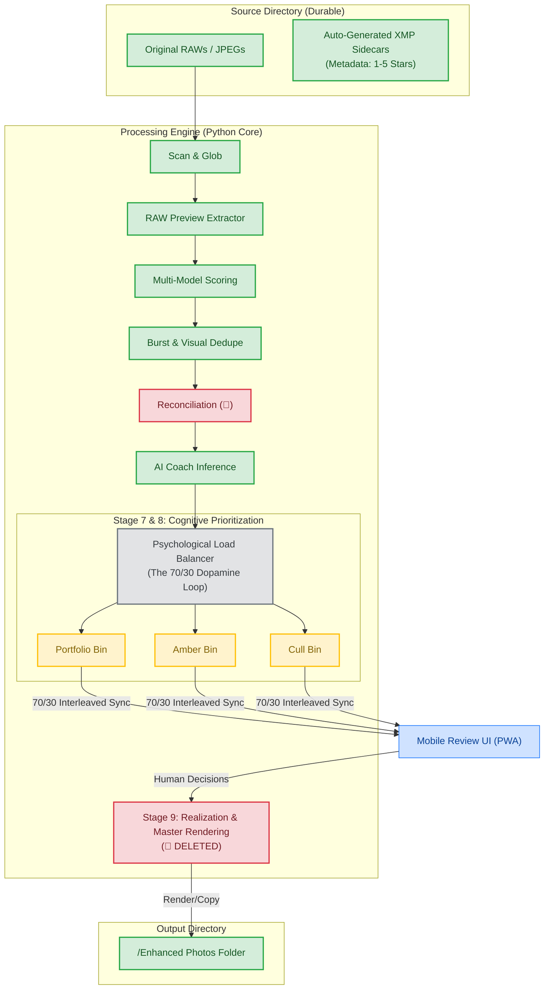

# Antigravity Engine: Master Architecture & Data Flow (v2.4.0)

This document maps the **End-to-End Flywheel**. It emphasizes **Flow State Optimization**, **Non-Destructive Data Management**, and the **70/30 Cognitive Load Balance**.

---

## 1. Professional Data Flow (The 9-Stage Optimized Engine)

---

## 2. Process Deep Dive

### A. Non-Destructive File Management
*   **Physical Integrity**: Source files are never moved. All decisions are written to **XMP Sidecars**.
*   **Consolidated Realization**: Only user-accepted masters are rendered into the `/Enhanced` folder.

### B. The 70/30 Cognitive Load Model (Stage 8.5)
To prevent "Decision Paralysis" and maintain your **Flow State** during review, the prioritization engine uses a constant-ratio interleaving algorithm:
1.  **Dopamine Ratio**: The review queue is stacked such that you have a **70% probability of an "Accept"** and a **30% probability of a "Reject"**. 
2.  **Decision Anti-Stagnancy**: We introduce minor randomization (stochastic jitter) in the ranking to prevent your brain from "autopiloting" or developing bias.
3.  **Fatigue Prevention**: By keeping the 70/30 ratio constant across the entire subset, the engine reduces cognitive friction, making high-speed culling feel effortless rather than fatiguing.

---

## 3. Engineering Impact Analysis (🚩)
*   **🚩 Stage 8.5 Load Balancer**: Requires a new stochastic interleaving module to manage the 70/30 distribution across the Portfolio, Amber, and Cull bins.
*   **🚩 Stage 9 Realization**: The service listening for these 70/30 decisions and executing the final rendering is currently broken.
